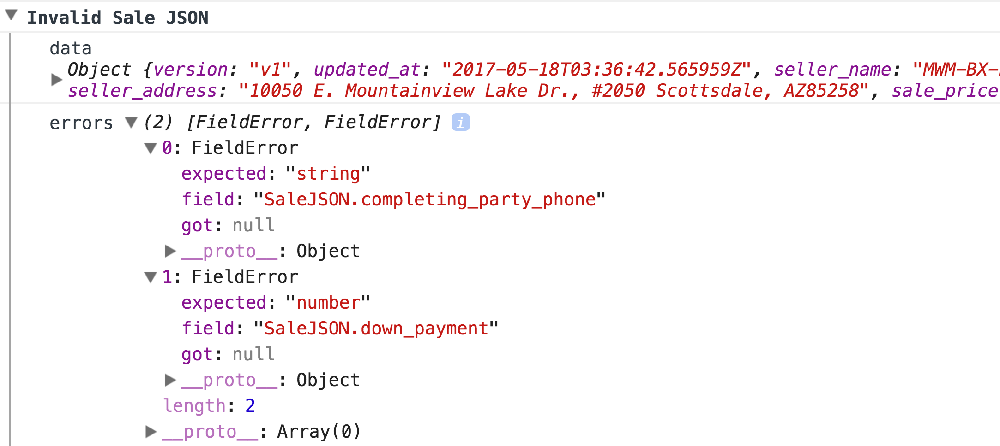

# izz-ts

A TypeScript Guard Type Checker

## Install

`npm install --save izz-ts`

## Example

### Code

```typescript
import * as izz from 'izz-ts'

export class Sale {
  key:                       string = ''
  completing_party_name:     string = ''
  completing_party_address:  string = ''
  completing_party_phone:    string = ''
  down_payment:     (null | number) = null
  sale_price:       (null | number) = null

  static paramsValidator = izz.object({
    key:                       izz.string,
    completing_party_name:     izz.string,
    completing_party_address:  izz.string,
    completing_party_phone:    izz.string,
    sale_price:                izz.number,
    down_payment:              izz.number,
  })

  static isValidJSON(data: any): data is Sale {
    return Sale.paramsValidator.isValid(data)
  }

  static fromJSON(data: any): (Sale | never) {
    if (Sale.isValidJSON(data)) {
      return new Sale(data)
    } else {
      let val = new izz.DataValidator('SaleJSON', Sale.paramsValidator, data)
      console.groupCollapsed('Invalid Sale JSON')
      console.log('data', data)
      console.log('errors', val.errors)
      console.groupEnd()
      throw new Error(`Invalid Sale JSON`)
    }
  }

  constructor(params: (Sale | null) = null) {
    if (params) {
      this.key                      = params.key
      this.completing_party_name    = params.completing_party_name
      this.completing_party_address = params.completing_party_address
      this.completing_party_phone   = params.completing_party_phone
      this.sale_price               = params.sale_price
      this.down_payment             = params.down_payment
    }
  }
}
```

### Logged Invalid Data

